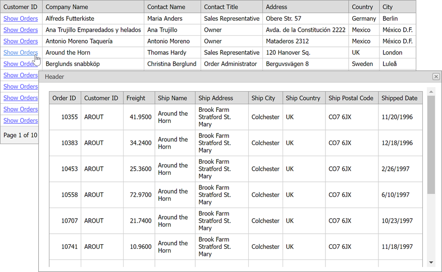

<!-- default badges list -->
[](https://supportcenter.devexpress.com/ticket/details/E2193)
[](https://docs.devexpress.com/GeneralInformation/403183)
<!-- default badges end -->

# Grid View for ASP.NET Web Forms - How to Display a Popup Dialog When a User Clicks a Link in a Grid Row
<!-- run online -->
**[[Run Online]](https://codecentral.devexpress.com/e2193/)**
<!-- run online end -->

This example shows how to create a grid that contains hyperlinks in one of its columns. When a user clicks a hyperlink, a separate popup dialog ([ASPxPopupControl](https://docs.devexpress.com/AspNet/DevExpress.Web.ASPxPopupControl)) is shown.



Call the client-side [SetContentUrl](https://docs.devexpress.com/AspNet/js-ASPxClientPopupControlBase.SetContentUrl(url)) method to embed a web page to be displayed to the popup.

```aspx
function ShowDetailPopup(customerID) {
    popup.SetContentUrl('Orders.aspx?id=' + customerID);
    popup.Show();
}
<dx:GridViewDataHyperLinkColumn FieldName="CustomerID" 
                                ReadOnly="True" 
                                VisibleIndex="0">
    <PropertiesHyperLinkEdit NavigateUrlFormatString="javascript:ShowDetailPopup('{0}');"
        Text="Show Orders">
    </PropertiesHyperLinkEdit>
</dx:GridViewDataHyperLinkColumn>
```        

## Files to Look At

* [Default.aspx](./CS/ShowDetailInPopup/Default.aspx) (VB: [Default.aspx](./VB/ShowDetailInPopup/Default.aspx))
* [Orders.aspx](./CS/ShowDetailInPopup/Orders.aspx) (VB: [Orders.aspx](./VB/ShowDetailInPopup/Orders.aspx))


## Documentation

* [ASPxGridView](https://docs.devexpress.com/AspNet/DevExpress.Web.ASPxGridView)
* [ASPxPopupControl](https://docs.devexpress.com/AspNet/DevExpress.Web.ASPxPopupControl?p=netframework)

## More Examples

* [How to show popup by clicking a hyperlink in grid column's DataItemTemplate](https://github.com/DevExpress-Examples/how-to-show-popup-by-clicking-a-hyperlink-in-grid-columns-dataitemtemplate-e2270)
* [How to show detail information in a separate ASPxGridView](https://github.com/DevExpress-Examples/how-to-show-detail-information-in-a-separate-aspxgridview-e70)
* [How to display master-detail tables in two grids on separate tabs of a PageControl](https://github.com/DevExpress-Examples/how-to-display-master-detail-tables-in-two-grids-on-separate-tabs-of-a-pagecontrol-e1285)
* [Popup Control for ASP.NET Web Forms - How to show a pop-up window](https://github.com/DevExpress-Examples/web-forms-show-popup-window)
* [How to display detail data within a popup window using ASPxPopupControl content elements](https://github.com/DevExpress-Examples/how-to-display-detail-data-within-a-popup-window-using-aspxpopupcontrol-content-elements-e5202)
* [GridView - How to open popup on a hyperlink click (MVC)](https://github.com/DevExpress-Examples/gridview-how-to-open-popup-on-a-hyperlink-click-e20052)
* [How to display detail data within a popup window using ContentUrl (MVC)](https://github.com/DevExpress-Examples/how-to-display-detail-data-within-a-popup-window-using-contenturl-mvc-e20051)
